# ReserveX - CI/CD Architecture Documentation

This document provides detailed visual representations of the ReserveX CI/CD pipeline architecture, security layers, and Kubernetes deployment topology.

---

## 1. Complete Pipeline Flow

The end-to-end flow from developer push to production deployment:

```mermaid
graph TB
    subgraph "Developer Workstation"
        A[👨‍💻 Developer<br/>Code Changes]
    end
    
    subgraph "Version Control"
        B[📁 GitHub Repository<br/>harshpanchal04/ReserveX]
    end
    
    subgraph "CI Pipeline - GitHub Actions Runner"
        C[1. 📥 Checkout<br/>actions/checkout@v4]
        D[2. 🐍 Setup Python<br/>Python 3.10 + pip cache]
        E[3. 📏 Linting<br/>Flake8 - PEP8 compliance]
        F[4. 🔍 SAST<br/>CodeQL Analysis]
        G[5. 📦 SCA<br/>OWASP Dependency Check]
        H[6. 🧪 Unit Tests<br/>Pytest - solver.py tests]
        I[7. 🐳 Docker Build<br/>Multi-stage Dockerfile]
        J[8. 🚀 Smoke Test<br/>Container startup verification]
        K[9. 🛡️ Image Scan<br/>Trivy - CVE detection]
        L[10. 📤 Push<br/>DockerHub registry]
    end
    
    subgraph "Container Registry"
        M[🐳 DockerHub<br/>harshpanchal04/reservex:latest]
    end
    
    subgraph "CD Pipeline - GitHub Actions Runner"
        N[1. 🔌 SSH Connect<br/>appleboy/ssh-action]
        O[2. ⚙️ Bootstrap<br/>K3s installation check]
        P[3. 📝 Write Manifests<br/>deployment.yaml + service.yaml]
        Q[4. 🚀 Apply<br/>kubectl apply -f]
        R[5. 🔄 Rolling Update<br/>kubectl rollout restart]
        S[6. ❤️ Health Check<br/>curl localhost:30001]
    end
    
    subgraph "AWS Cloud Infrastructure"
        subgraph "EC2 Instance - t2.micro"
            subgraph "K3s Kubernetes Cluster"
                T[📦 Pod 1<br/>reservex container]
                U[📦 Pod 2<br/>reservex container]
                V[🔀 Service<br/>NodePort 30001]
            end
        end
    end
    
    subgraph "End Users"
        W[🌐 Internet Users<br/>http://EC2-PUBLIC-IP:30001]
    end
    
    A -->|git push| B
    B -->|trigger| C
    C --> D --> E --> F --> G --> H --> I --> J --> K --> L
    L -->|publish| M
    M -->|trigger CD| N
    N --> O --> P --> Q --> R --> S
    S --> T
    S --> U
    V --> T
    V --> U
    W -->|HTTP request| V
    
    style A fill:#e3f2fd,stroke:#1976d2
    style M fill:#fff8e1,stroke:#ff8f00
    style T fill:#e8f5e9,stroke:#388e3c
    style U fill:#e8f5e9,stroke:#388e3c
    style V fill:#f3e5f5,stroke:#7b1fa2
    style W fill:#fce4ec,stroke:#c2185b
```



---

## 2. Security Layers (Shift-Left Approach)

Security is integrated at every stage, not bolted on at the end:

```mermaid
graph LR
    subgraph "Shift-Left Security Pipeline"
        A[📝 Source Code] --> B
        
        subgraph "Layer 1: Code"
            B[🔍 SAST<br/>CodeQL<br/>Semantic Analysis]
        end
        
        B --> C
        
        subgraph "Layer 2: Dependencies"
            C[📦 SCA<br/>OWASP DC<br/>CVE Database]
        end
        
        C --> D
        
        subgraph "Layer 3: Container"
            D[🐳 Container Scan<br/>Trivy<br/>OS + Library CVEs]
        end
        
        D --> E
        
        subgraph "Layer 4: Runtime"
            E[🧪 Smoke Test<br/>curl<br/>Startup Verification]
        end
        
        E --> F[✅ Production<br/>Secure Deployment]
    end
    
    style B fill:#ffcdd2,stroke:#c62828
    style C fill:#f8bbd0,stroke:#ad1457
    style D fill:#e1bee7,stroke:#7b1fa2
    style E fill:#d1c4e9,stroke:#512da8
    style F fill:#c8e6c9,stroke:#2e7d32
```



### Security Tools Matrix

| Layer | Tool | Detection Capability | Action on Finding |
|-------|------|---------------------|-------------------|
| **Code** | CodeQL | SQL injection, XSS, insecure deserialization | ❌ Block merge |
| **Dependencies** | OWASP DC | Known CVEs in Python packages | ⚠️ Warn + Report |
| **Container** | Trivy | OS vulnerabilities, outdated packages | ❌ Block on CRITICAL/HIGH |
| **Runtime** | Smoke Test | Missing environment variables, crash on start | ❌ Block deployment |

---

## 3. Kubernetes Architecture

The production deployment topology on K3s:

```mermaid
graph TB
    subgraph "Namespace: default"
        subgraph "Deployment: reservex-deployment"
            A[📋 ReplicaSet<br/>Desired: 2 pods]
            A --> B[📦 Pod 1<br/>Container: reservex<br/>Port: 8501]
            A --> C[📦 Pod 2<br/>Container: reservex<br/>Port: 8501]
        end
        
        subgraph "Service: reservex-service"
            D[🔀 Service<br/>Type: NodePort<br/>Port: 30001 → 8501]
        end
        
        D --> B
        D --> C
    end
    
    E[🌐 Internet] --> F[🖥️ EC2 Public IP:30001]
    F --> D
    
    subgraph "Container Details"
        G[🐳 Image: harshpanchal04/reservex:latest<br/>Base: mcr.microsoft.com/playwright/python<br/>App Port: 8501]
    end
    
    B -.-> G
    C -.-> G
    
    style A fill:#bbdefb,stroke:#1976d2
    style B fill:#c8e6c9,stroke:#388e3c
    style C fill:#c8e6c9,stroke:#388e3c
    style D fill:#fff9c4,stroke:#fbc02d
    style E fill:#ffccbc,stroke:#e64a19
    style F fill:#e1bee7,stroke:#7b1fa2
```



### Kubernetes Manifest Summary

```yaml
# Deployment Configuration
apiVersion: apps/v1
kind: Deployment
metadata:
  name: reservex-deployment
spec:
  replicas: 2                    # High availability
  strategy:
    type: RollingUpdate          # Zero-downtime updates
  template:
    spec:
      containers:
      - name: reservex
        image: harshpanchal04/reservex:latest
        imagePullPolicy: Always  # Pull fresh image on restart
        ports:
        - containerPort: 8501    # Streamlit default port
```

```yaml
# Service Configuration
apiVersion: v1
kind: Service
metadata:
  name: reservex-service
spec:
  type: NodePort
  ports:
  - port: 8501
    targetPort: 8501
    nodePort: 30001              # External access port
```

---

## 4. Deployment Sequence Diagram

The step-by-step interaction during deployment:

```mermaid
sequenceDiagram
    participant Dev as 👨‍💻 Developer
    participant GH as 📁 GitHub
    participant CI as 🔧 CI Pipeline
    participant DH as 🐳 DockerHub
    participant CD as 🚀 CD Pipeline
    participant EC2 as 🖥️ AWS EC2
    participant K3s as ☸️ K3s Cluster
    
    Dev->>GH: git push origin main
    activate GH
    GH->>CI: Trigger CI Pipeline
    activate CI
    
    Note over CI: Lint → SAST → SCA → Test
    CI->>CI: Build Docker Image
    CI->>CI: Smoke Test (curl)
    CI->>CI: Trivy Scan
    
    alt Security Check Passed
        CI->>DH: Push Image
        DH-->>CI: Push Confirmed
        CI-->>GH: ✅ CI Success
    else Security Check Failed
        CI-->>GH: ❌ CI Failed
        GH-->>Dev: Build Failed Notification
    end
    deactivate CI
    
    GH->>CD: Trigger CD Pipeline
    activate CD
    CD->>EC2: SSH Connect
    activate EC2
    
    Note over EC2: Check K3s Installation
    
    alt K3s Not Found
        EC2->>EC2: Install K3s
        EC2->>EC2: Configure kubectl
    end
    
    EC2->>K3s: kubectl apply -f manifests
    activate K3s
    K3s->>DH: Pull reservex:latest
    DH-->>K3s: Image Downloaded
    K3s->>K3s: Create Pods
    K3s->>K3s: Rolling Update
    K3s-->>EC2: Rollout Complete
    deactivate K3s
    
    EC2->>EC2: Health Check (curl :30001)
    
    alt Health Check Passed
        EC2-->>CD: ✅ Deployment Success
        CD-->>GH: ✅ CD Success
    else Health Check Failed
        EC2-->>CD: ❌ Deployment Failed
        CD-->>GH: ❌ CD Failed
    end
    
    deactivate EC2
    deactivate CD
    deactivate GH
    
    GH-->>Dev: Pipeline Complete Notification
```



---

## 5. High Availability Design

How the system handles failures:

```mermaid
graph TB
    A[🌐 User Request] --> B[🔀 Service<br/>Load Balancer]
    
    B --> C{❤️ Health<br/>Check}
    
    C -->|Healthy| D[📦 Pod 1<br/>✅ Running]
    C -->|Healthy| E[📦 Pod 2<br/>✅ Running]
    
    C -->|Unhealthy| F[☸️ Kubernetes<br/>Controller]
    
    F -->|Restart| D
    F -->|Restart| E
    
    subgraph "Self-Healing Loop"
        G[🔄 Desired State: 2 replicas]
        H[📊 Current State: N replicas]
        G --> I{Match?}
        H --> I
        I -->|No| J[🔧 Reconcile]
        J --> G
        I -->|Yes| K[✅ Healthy]
    end
    
    style A fill:#e3f2fd,stroke:#1976d2
    style B fill:#fff3e0,stroke:#ff9800
    style C fill:#f3e5f5,stroke:#9c27b0
    style D fill:#c8e6c9,stroke:#4caf50
    style E fill:#c8e6c9,stroke:#4caf50
    style F fill:#ffcdd2,stroke:#f44336
    style K fill:#c8e6c9,stroke:#4caf50
```



### Failure Scenarios

| Scenario | Kubernetes Response | User Impact |
|----------|---------------------|-------------|
| Pod crashes | Restart pod automatically | Minimal (other pod serves traffic) |
| Node failure | Reschedule pods | Brief disruption during reschedule |
| Image pull failure | Keep old pods running | Zero (deployment fails safely) |
| Health check fails | Don't promote new pods | Zero (old version continues) |

---

## 6. Network Topology

How traffic flows from the internet to the application:

```mermaid
graph LR
    subgraph "Internet"
        A[🌐 User Browser]
    end
    
    subgraph "AWS"
        subgraph "VPC"
            subgraph "Security Group"
                B[🛡️ Inbound Rules<br/>Port 22: SSH<br/>Port 30001: App]
            end
            
            subgraph "EC2 Instance"
                C[🖥️ Public IP<br/>Elastic Network Interface]
                
                subgraph "K3s"
                    D[🔀 kube-proxy<br/>iptables rules]
                    E[📦 Pod Network<br/>10.42.0.0/16]
                end
            end
        end
    end
    
    A -->|HTTP :30001| B
    B --> C
    C --> D
    D --> E
    
    style A fill:#e3f2fd
    style B fill:#ffcdd2
    style C fill:#fff9c4
    style D fill:#e1bee7
    style E fill:#c8e6c9
```



---

## Quick Reference

### Pipeline Trigger Summary

| Event | CI Triggered | CD Triggered |
|-------|--------------|--------------|
| Push to `main` | ✅ Yes | ✅ Yes (on CI success) |
| Pull Request | ✅ Yes | ❌ No |
| Manual Dispatch | ✅ Yes | ✅ Yes |

### Port Mapping

| Port | Protocol | Purpose |
|------|----------|---------|
| 22 | TCP | SSH access for deployment |
| 8501 | TCP | Streamlit app (internal) |
| 30001 | TCP | NodePort (external access) |
| 6443 | TCP | Kubernetes API (internal) |

---

*Architecture documentation for ReserveX CI/CD Pipeline*
